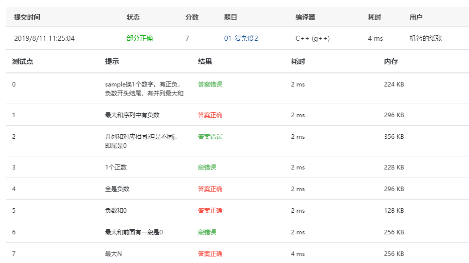
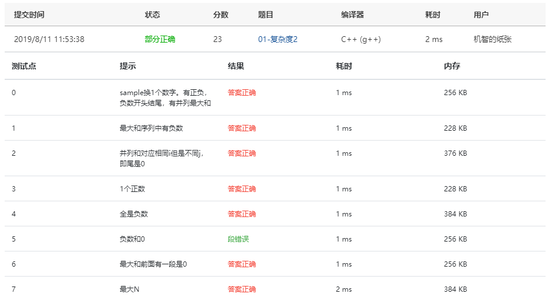
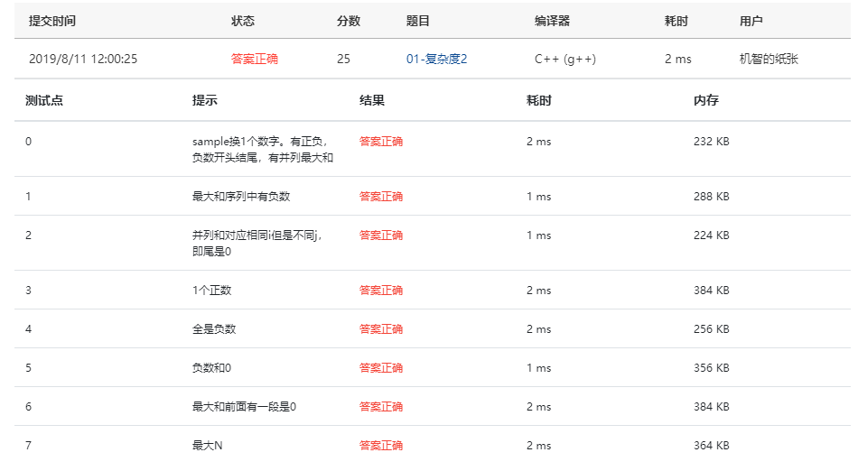

Given a sequence of *K* integers { *N*1, *N*2, ..., *N**K* }. A continuous subsequence is defined to be { *N**i*, *N**i*+1, ..., *N**j* } where 1≤*i*≤*j*≤*K*. The Maximum Subsequence is the continuous subsequence which has the largest sum of its elements. For example, given sequence { -2, 11, -4, 13, -5, -2 }, its maximum subsequence is { 11, -4, 13 } with the largest sum being 20.

Now you are supposed to find the largest sum, together with the first and the last numbers of the maximum subsequence.

### Input Specification:

Each input file contains one test case. Each case occupies two lines. The first line contains a positive integer *K* (≤10000). The second line contains *K* numbers, separated by a space.

### Output Specification:

For each test case, output in one line the largest sum, together with the first and the last numbers of the maximum subsequence. The numbers must be separated by one space, but there must be no extra space at the end of a line. In case that the maximum subsequence is not unique, output the one with the smallest indices *i* and *j* (as shown by the sample case). If all the *K* numbers are negative, then its maximum sum is defined to be 0, and you are supposed to output the first and the last numbers of the whole sequence.

### Sample Input:

```in
10
-10 1 2 3 4 -5 -23 3 7 -21
```

### Sample Output:

```out
10 1 4
```

### Answers

First try:

```c
#include<stdio.h>
#include<stdlib.h>
struct out {
    int sum;
    int Start;
    int End;
};

out MaxSubSum( int k, int L[] )
{
    int i = 0;
    out Max;
    int Maxsum = 0;
    int Tmpsum = 0;
    for (i = 0; i < k; i++) {
        Tmpsum += L[i];
        if ( Tmpsum > Maxsum ) {
            Maxsum = Tmpsum;
            Max.End = i;
        }
        if ( Tmpsum < 0 ) {
            Tmpsum = 0;
            Max.Start = i + 1;
        }
    }
    Max.sum = Maxsum;
    return Max;
}

int main()
{
    int k;
    scanf("%d", &k);
    int L[k];
    for ( int i = 0; i < k; i++ ) scanf("%d", &L[i]);
    out MainOut;
    MainOut = MaxSubSum( k, L );
    printf("%d %d %d", MainOut.sum, L[MainOut.Start], L[MainOut.End]);
    return 0;
}
```

Screenshot:


问题很多，与第一题不一样，这里的数据有很多负数，需要使用另外的计算方法，不能套用第一题的方法，留个尾巴，明早再战

Second try:

```c
#include<stdio.h>
#include<stdlib.h>
struct out {
    int sum;
    int Start;
    int End;
};

out MaxSubSum( int k, int L[] )
{
    int i = 0;
    out Max;
    int Maxsum = 0;
    int Tmpsum = 0;
    int cnt = 0;
    for (i = 0; i < k; i++) {
        if ( L[i] != 0 ) {
            Tmpsum += L[i];
            if ( Tmpsum > Maxsum ) {
                Maxsum = Tmpsum;
                Max.End = i;
            }
            if ( Tmpsum < 0 ) {
                Tmpsum = 0;
                Max.Start = i + 1;
                cnt += 1;
            }
        }
        else {
            if ( Tmpsum < 0 ) {
                Tmpsum = 0;
                Max.Start = i;
            }
            if ( Tmpsum == Maxsum ) Max.End = i;
        }
    }
    if ( cnt == k ) {
        Max.sum = 0;
        Max.Start = 0;
        Max.End = k - 1;
    }
    Max.sum = Maxsum;
    return Max;
}

int main()
{
    int k;
    scanf("%d", &k);
    int L[k];
    for ( int i = 0; i < k; i++ ) scanf("%d", &L[i]);
    out MainOut;
    MainOut = MaxSubSum( k, L );
    printf("%d %d %d", MainOut.sum, L[MainOut.Start], L[MainOut.End]);
    return 0;
}
```

Screenshot:



修好了负数的问题，但是并列多解的部分还是不会

Third try:

```c
#include<stdio.h>
#include<stdlib.h>
struct out {
    int sum;
    int Start;
    int End;
};

out MaxSubSum( int k, int L[] )
{
    int i = 0;
    out Max;
    int Maxsum = 0;
    int Tmpsum = 0;
    int Tmpidx = 0;
    int cnt = 0;
    for (i = 0; i < k; i++) {
        if ( L[i] != 0 ) {
            Tmpsum += L[i];
            if ( Tmpsum > Maxsum ) {
                Maxsum = Tmpsum;
                Max.Start = Tmpidx;
                Max.End = i;
            }
            if ( Tmpsum < 0 ) {
                Tmpsum = 0;
                Tmpidx = i + 1;
                cnt += 1;
            }
        }
        else {
            if ( Tmpsum < 0 ) {
                Tmpsum = 0;
                Tmpidx = i;
            }
            if ( Tmpsum == Maxsum ) Max.End = i - 1;
        }
    }
    if ( cnt == k ) {
        Max.sum = 0;
        Max.Start = 0;
        Max.End = k - 1;
    }
    Max.sum = Maxsum;
    return Max;
}

int main()
{
    int k;
    scanf("%d", &k);
    int L[k];
    for ( int i = 0; i < k; i++ ) scanf("%d", &L[i]);
    out MainOut;
    MainOut = MaxSubSum( k, L );
    printf("%d %d %d", MainOut.sum, L[MainOut.Start], L[MainOut.End]);
    return 0;
}
```

screenshot:



百度了一下，发现自己审题审错了，之前以为所有并列的解需要全部输出，重新审题发现只需要输出index最小的子列即可，修改后还差负数和0没有处理正确。

Fourth try:

```c
#include<stdio.h>
#include<stdlib.h>
struct out {
    /*定义结构体，由最大子列和，起始位置的index和结束位置的index组成*/
    int sum;
    int Start;
    int End;
};

out MaxSubSum( int k, int L[] )
{
    int i = 0;
    out Max;
    int Maxsum = 0;
    int Tmpsum = 0;	/*暂存子列和*/
    int Tmpidx = 0;	/*暂存下标*/
    int cnt = 0;	/*存储数列中负数的个数*/
    for (i = 0; i < k; i++) {
        if ( L[i] != 0 ) {	/*当此数不为0时（因为0时会产生并列问题，需要另外处理）*/
            Tmpsum += L[i];
            if ( Tmpsum > Maxsum ) {
                Maxsum = Tmpsum;
                Max.Start = Tmpidx;
                Max.End = i;
            }
            if ( Tmpsum < 0 ) {
                Tmpsum = 0;
                Tmpidx = i + 1;
                cnt += 1;
            }
        }
        else {	/*此数为0*/
            if ( Maxsum == 0 ) {	/*且当前最大子列和为0（即此数前面并没有找到最大子列和，还有一个问题就是当数列为负数带很多0时这里无法输出第一个0的位置，需要改进*/
                Max.Start = i;
                Max.End = i;
            }
        }
    }
    if ( cnt == k ) {	/*数列全部为负数，输出0和头尾*/
        Max.sum = 0;
        Max.Start = 0;
        Max.End = k - 1;
    }
    Max.sum = Maxsum;
    return Max;
}

int main()
{
    int k;
    scanf("%d", &k);
    int L[k];
    for ( int i = 0; i < k; i++ ) scanf("%d", &L[i]);
    out MainOut;
    MainOut = MaxSubSum( k, L );
    printf("%d %d %d", MainOut.sum, L[MainOut.Start], L[MainOut.End]);
    return 0;
}
```

screenshot:



