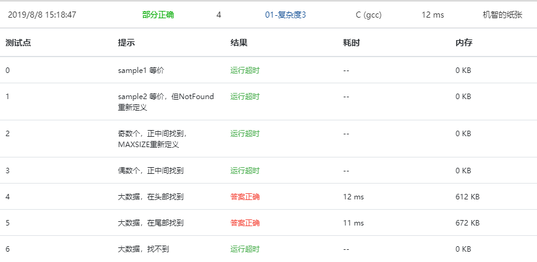
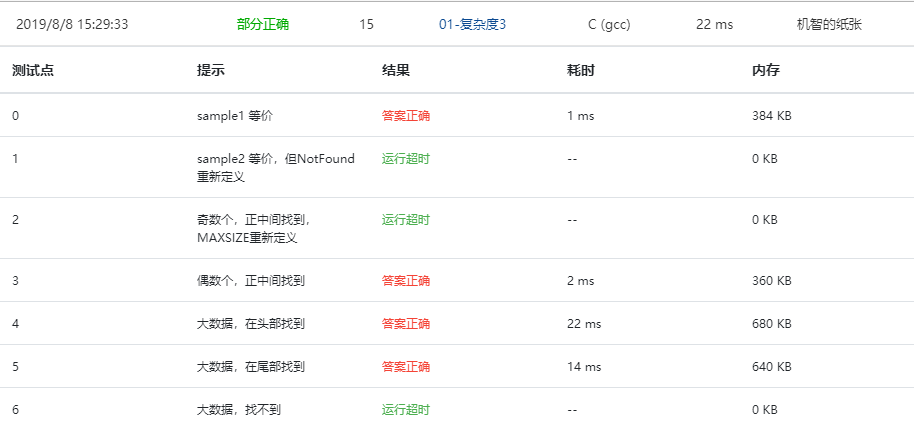
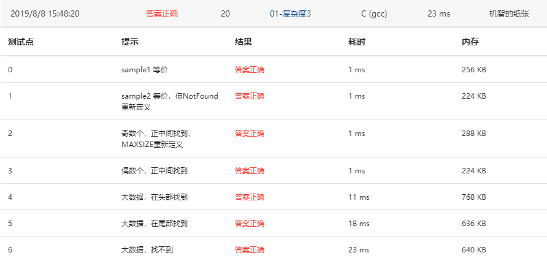

本题要求实现二分查找算法。

### 函数接口定义：

```c++
Position BinarySearch( List L, ElementType X );
```

其中`List`结构定义如下：

```c++
typedef int Position;
typedef struct LNode *List;
struct LNode {
    ElementType Data[MAXSIZE];
    Position Last; /* 保存线性表中最后一个元素的位置 */
};
```

`L`是用户传入的一个线性表，其中`ElementType`元素可以通过>、==、<进行比较，并且题目保证传入的数据是递增有序的。函数`BinarySearch`要查找`X`在`Data`中的位置，即数组下标（注意：元素从下标1开始存储）。找到则返回下标，否则返回一个特殊的失败标记`NotFound`。

### 裁判测试程序样例：

```c++
#include <stdio.h>
#include <stdlib.h>

#define MAXSIZE 10
#define NotFound 0
typedef int ElementType;

typedef int Position;
typedef struct LNode *List;
struct LNode {
    ElementType Data[MAXSIZE];
    Position Last; /* 保存线性表中最后一个元素的位置 */
};

List ReadInput(); /* 裁判实现，细节不表。元素从下标1开始存储 */
Position BinarySearch( List L, ElementType X );

int main()
{
    List L;
    ElementType X;
    Position P;

    L = ReadInput();
    scanf("%d", &X);
    P = BinarySearch( L, X );
    printf("%d\n", P);

    return 0;
}

/* 你的代码将被嵌在这里 */
```

### 输入样例1：

```in
5
12 31 55 89 101
31
```

### 输出样例1：

```out
2
```

### 输入样例2：

```
3
26 78 233
31
```

### 输出样例2：

```
0
```

### 答案：

#### 第一次

```c
Position BinarySearch( List L, ElementType X )
{
    int i = MAXSIZE/2;
    while( i > 0 && L->Data[i] != X)
    {
        if( L->Data[i] > X) i = i/2;
        else i = ( i + MAXSIZE )/2;
    }
    if(L->Data[i] == X) return i;
    else return NotFound;
}
```

部分正确

####  第二次

```c
Position BinarySearch( List L, ElementType X )
{
    Position i = 0;
    if(L->Last%2) i = L->Last / 2;
    else i = (L->Last + 1) / 2;
    while( i >= 1 && L->Data[i] != X)
    {
        if( L->Data[i] > X) i = i / 2;
        else i = ( i + L->Last + 1 ) / 2;
    }
    if(L->Data[i] == X) return i;
    else return NotFound;
}
```

部分正确



#### 第三次

```c
Position BinarySearch( List L, ElementType X )
{
    Position i = 0;
    if(L->Last%2) i = (L->Last + 1)/ 2;
    else i = L->Last / 2;
    while( L->Data[i] != X && i < L->Last && i > 1 ) {
        if( L->Data[i] > X) {
            if( L->Data[i-1] < X) break;
            else i = ( i + i / 2 ) / 2;
        } else {
            if( L->Data[i+1] > X) break;
            else i = ( i + L->Last + 1 ) / 2;
        }
    }
    if(L->Data[i] == X) return i;
    else return NotFound;
}
```

完全正确

