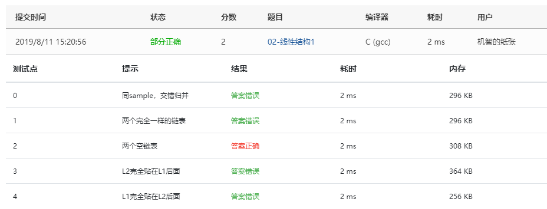
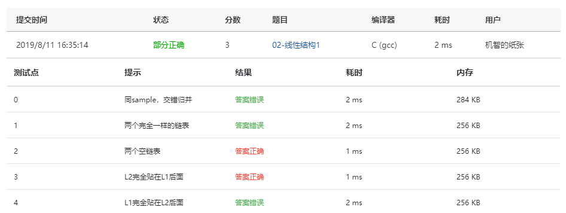
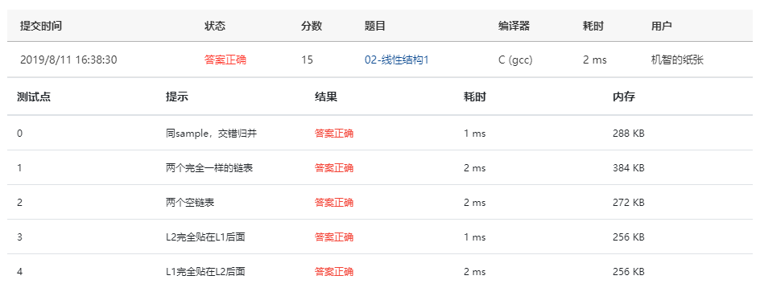

本题要求实现一个函数，将两个链表表示的递增整数序列合并为一个非递减的整数序列。

### 函数接口定义：

```c++
List Merge( List L1, List L2 );
```

其中`List`结构定义如下：

```c++
typedef struct Node *PtrToNode;
struct Node {
    ElementType Data; /* 存储结点数据 */
    PtrToNode   Next; /* 指向下一个结点的指针 */
};
typedef PtrToNode List; /* 定义单链表类型 */
```

`L1`和`L2`是给定的带头结点的单链表，其结点存储的数据是递增有序的；函数`Merge`要将`L1`和`L2`合并为一个非递减的整数序列。应直接使用原序列中的结点，返回归并后的带头结点的链表头指针。

### 裁判测试程序样例：

```c++
#include <stdio.h>
#include <stdlib.h>

typedef int ElementType;
typedef struct Node *PtrToNode;
struct Node {
    ElementType Data;
    PtrToNode   Next;
};
typedef PtrToNode List;

List Read(); /* 细节在此不表 */
void Print( List L ); /* 细节在此不表；空链表将输出NULL */

List Merge( List L1, List L2 );

int main()
{
    List L1, L2, L;
    L1 = Read();
    L2 = Read();
    L = Merge(L1, L2);
    Print(L);
    Print(L1);
    Print(L2);
    return 0;
}

/* 你的代码将被嵌在这里 */
```

### 输入样例：

```in
3
1 3 5
5
2 4 6 8 10
```

### 输出样例：

```out
1 2 3 4 5 6 8 10 
NULL
NULL
```

### 答案：

第一次：

```c
List Merge( List L1, List L2 )
{
    List L;
    L = (List)malloc( sizeof(struct Node));
    while( L1->Next && L2->Next ) {
        if ( L1->Data < L2->Data ) {
            L->Data = L1->Data;
            L1 = L1->Next;
        } else {
            L->Data = L2->Data;
            L2 = L2->Next;
        }
    }
    return L;
}
```

提交截图：



第一次算法里没有考虑到完全贴在后面和完全一样的情况，并且忘记了每次跑完指向`L->Next`，`L`完全没有变成一个完整的链表

第二次

```c
List Merge( List L1, List L2 )
{
    List L;
    List tmp, tmp1, tmp2;
    L = (List)malloc( sizeof(struct Node));
    tmp = L;
    tmp1 = L1->Next;
    tmp2 = L2->Next;
    while ( tmp1 && tmp2 ) {
        if ( tmp1 < tmp2 ) {
            tmp->Next = tmp1;
            tmp1 = tmp1->Next;
        } else {
            tmp->Next = tmp2;
            tmp2 = tmp2->Next;
        }
        tmp = tmp->Next;
    }
    tmp->Next = NULL;
    if(tmp1) tmp->Next = tmp1;
    if(tmp2) tmp->Next = tmp2;
    L1->Next = NULL;
    L2->Next = NULL;
    return L;
}
```

提交截图：



第一次没有仔细审题，此题使用的是带头结点的链表，需要忽略掉第一位的头结点，比对后面的结点。。这里内部的判断条件里`tmp1->Data < tmp2->Data`错写为了`tmp1 < tmp2`导致答案错误，第三次修正。

第三次：

```c
List Merge( List L1, List L2 )
{
    List L;
    List tmp, tmp1, tmp2;
    L = (List)malloc( sizeof(struct Node));
    tmp = L;
    tmp1 = L1->Next;
    tmp2 = L2->Next;
    while ( tmp1 && tmp2 ) {
        if ( tmp1->Data < tmp2->Data ) {
            tmp->Next = tmp1;
            tmp1 = tmp1->Next;
        } else {
            tmp->Next = tmp2;
            tmp2 = tmp2->Next;
        }
        tmp = tmp->Next;
    }
    tmp->Next = NULL;
    if(tmp1) tmp->Next = tmp1;
    if(tmp2) tmp->Next = tmp2;
    L1->Next = NULL;
    L2->Next = NULL;
    return L;
}
```

提交截图

