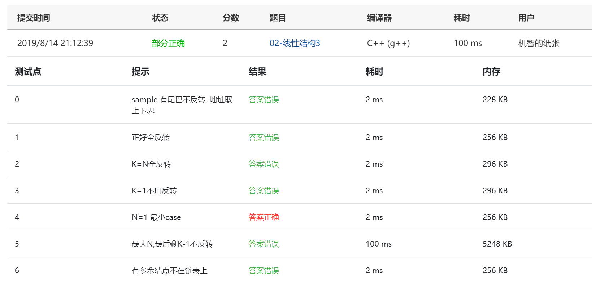

Given a constant *K* and a singly linked list *L*, you are supposed to reverse the links of every *K* elements on *L*. For example, given *L* being 1→2→3→4→5→6, if *K*=3, then you must output 3→2→1→6→5→4; if *K*=4, you must output 4→3→2→1→5→6.

### Input Specification:

Each input file contains one test case. For each case, the first line contains the address of the first node, a positive *N* (≤105) which is the total number of nodes, and a positive *K* (≤*N*) which is the length of the sublist to be reversed. The address of a node is a 5-digit nonnegative integer, and NULL is represented by -1.

Then *N* lines follow, each describes a node in the format:

```
Address Data Next
```

where `Address` is the position of the node, `Data` is an integer, and `Next` is the position of the next node.

### Output Specification:

For each case, output the resulting ordered linked list. Each node occupies a line, and is printed in the same format as in the input.

### Sample Input:

```in
00100 6 4
00000 4 99999
00100 1 12309
68237 6 -1
33218 3 00000
99999 5 68237
12309 2 33218
```

### Sample Output:

```out
00000 4 33218
33218 3 12309
12309 2 00100
00100 1 99999
99999 5 68237
68237 6 -1
```

### Answers:

First try:

```c
#include<stdio.h>
#include<stdlib.h>

typedef struct LNode *List;
struct LNode {
    int Address;
    int Data;
    int Next;
    List RNext;
};

int main()
{
    int i, Start, N, K, times, n;
    scanf("%d%d%d", &Start, &N, &K);
    int Adds[N], Datas[N], Nexts[N];
    List L;
    List old, past, now, future, fresh;
    L = (List) malloc( sizeof(struct LNode));
    for ( i = 0; i < N; i++ ) {
        scanf("%d%d%d", (Adds+i), (Datas+i), (Nexts+i));
    }
    while(L->Address != Start) {
        for ( i = 0; i < N; i++ ) {
            if( Nexts[i] == -1 ) {
                L->Address = Adds[i];
                L->Data = Datas[i];
                L->Next = Nexts[i];
                L->RNext = NULL;
            }
            if( Nexts[i] == L->Address ) {
                L->RNext = L;
                L->Address = Adds[i];
                L->Data = Datas[i];
                L->Next = Nexts[i];
            }
        }
    }
    times = N/K;
    n = K;
    old = L;
    past = L;
    now = L;
    future = L;
    while(times--) {
        old = future;
        past = future;
        now = future;
        while( --n ) {
            now = now->RNext;
            future = now->RNext;
            now->RNext = past;
            now->Next = past->Address;
            past = past->RNext;
        }
        old->RNext = future;
        old->Next = future->Address;
    }
    fresh = L;
    for( i = 0; i < N; i++ ) {
        printf("%d %d %d", fresh->Address, fresh->Data, fresh->Next);
        fresh = fresh->RNext;
    }
    return 0;
}
```

Screenshot:


(第一次的问题主要应该是把数据存储到L时出现了问题，其实完全可以不使用数组进行存储，先按照输入顺序存储之后再不停循环来排序即可。)

secondtry:

```c
#include<stdio.h>
#include<stdlib.h>

typedef struct LNode *List;
struct LNode {
    int Address;
    int Data;
    int Next;
    List RNext;
};

int main()
{
    int i, Start, N, K, times, n;
    scanf("%d %d %d", &Start, &N, &K);
    List tmp, tmp1, tmp2;
    tmp = (List) malloc( sizeof(struct LNode));
    tmp->RNext = NULL;
    tmp1 = tmp;
    /*乱序链表*/
    for( i = 0; i < N; i++ ) {
        tmp2 = (List) malloc( sizeof(struct LNode));
        scanf("%d %d %d", &tmp2->Address, &tmp2->Data, &tmp2->Next);
        tmp1->RNext = tmp2;
        tmp1 = tmp2;
    }
    tmp1->RNext = NULL;
    
    /*链表排序*/
    List L, tmp3;
    L = (List) malloc( sizeof(struct LNode));
    L->RNext = NULL;
    int cnt = 0;
    int find = Start;
    tmp3 = L;
    while(find != -1) {
        tmp2 = tmp;
        while(tmp2->RNext) {
            if ( tmp2->RNext->Address == find ) {
                tmp3->RNext = tmp2->RNext;
                tmp2->RNext = tmp2->RNext->RNext;
                tmp3 = tmp3->RNext;
                cnt++;
                find = tmp3->Next;
            } else {
                tmp2 = tmp2->RNext;
            }
        }
    }
    tmp3->RNext = NULL;


    List RL, head, tmp4, tmp5;
    RL = (List) malloc( sizeof(struct LNode));
    RL->RNext = NULL;
    tmp4 = RL;
    tmp3 = L;
    times = cnt;
    while(times >= K) {
        times -= K;
        for( n = 0; n < K; n++ ) {
            tmp4->RNext = tmp3->RNext;
            tmp3->RNext = tmp3->RNext->RNext;
            if( n == 0 )
                head = tmp4->RNext;
            else
                tmp4->RNext->RNext = tmp5;
            tmp5 = tmp4->RNext;
        }
        tmp4 = head;
    }
    tmp4->RNext = L->RNext;

    tmp4 = RL->RNext;
    while(tmp4->RNext) {
        printf("%5d %d %5d\n", tmp4->Address, tmp4->Data, tmp4->RNext->Address);
        tmp4 = tmp4->RNext;
    }
    printf("%5d %d -1\n", tmp4->Address, tmp4->Data);
    return 0;
}
```

screenshot:



借鉴了搜索来的方法，但答案不对。

借鉴代码：

```c
#include <stdio.h>
#include <stdlib.h>

typedef struct Node
{
    int address;
    int data;
    int nextAddress;
    struct Node *next;
}Node;
typedef struct Node *LinkList;

int main()
{
    //排序前 
    LinkList L1, p1, q1;            
    L1 = (LinkList)malloc(sizeof(Node));    //创建头指针 
    L1->next = NULL;
    int firstAddress;
    int N, K;//N为总结点数 K为需翻转的数 
    scanf("%d %d %d", &firstAddress, &N, &K);
    p1 = L1;
    for(int i = 0; i < N; i++) {
        q1 =  (LinkList)malloc(sizeof(Node));
        scanf("%d %d %d",&q1->address, &q1->data, &q1->nextAddress);
        p1->next = q1;
        p1 = q1;
    }
    p1->next = NULL;
    
//    //测试没问题 
//    printf("测试1 ：\n");
//    p1 = L1->next;
//    while(p1){
//        printf("%05d %d %d\n", p1->address, p1->data, p1->nextAddress);
//        p1 = p1->next;
//    }
    
    //排序后 
    LinkList L2, p2;
    L2 = (LinkList)malloc(sizeof(Node));    //创建头指针 
    L2->next = NULL;
    int count = 0;
    int findAddress = firstAddress;
    p2 = L2;
    while(findAddress != -1) {            //while(count < N) {有多余结点不在链表上没通过 
    
        q1 = L1;
        while(q1->next) {
            if(q1->next->address == findAddress) {
                p2->next = q1->next;
                q1->next = q1->next->next;
                p2 = p2->next;
                count++;
//                printf("count = %d\n",count);
                findAddress = p2->nextAddress;
//                printf("findAddress = %d\n",findAddress);
            }else {
                q1 = q1->next;
            }
        }
    }
    p2->next = NULL;
    
//    //测试没问题 
//    printf("测试2 ：\n");
//    p2 = L2->next;
//    while(p2){
//        printf("%05d %d %05d\n", p2->address, p2->data, p2->nextAddress);
//        p2 = p2->next;
//    }
    //Reversing
    LinkList L3, p3, q3, tail;
    L3 = (LinkList)malloc(sizeof(Node));    //创建头指针 
    L3->next = NULL;
    //将L2以头插法插入L3
    int n = count;                //防止有多余结点影响 n=N 会影响
    int k = K;
    p3 = L3;
    p2 = L2;
    while(n >= k) {
        n -= k;
        for(int i = 0; i < k; i++) {
            p3->next = p2->next;
            p2->next = p2->next->next;
            if(i == 0)
                tail = p3->next;
            else 
                p3->next->next = q3;
            q3 = p3->next;
        }
        p3 = tail;
    }
    p3->next = L2->next;
    
    p3 = L3->next;
    while(p3->next) {
        printf("%05d %d %05d\n",p3->address, p3->data, p3->next->address);//不到五位数用0补全 
        p3 = p3->next;
    }
    printf("%05d %d -1\n",p3->address, p3->data);
    return 0;
}
```

