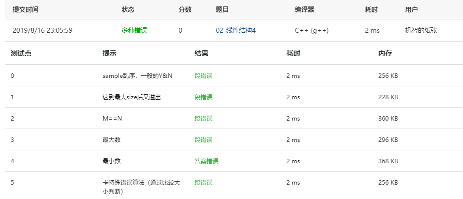

Given a stack which can keep *M* numbers at most. Push *N* numbers in the order of 1, 2, 3, ..., *N* and pop randomly. You are supposed to tell if a given sequence of numbers is a possible pop sequence of the stack. For example, if *M* is 5 and *N* is 7, we can obtain 1, 2, 3, 4, 5, 6, 7 from the stack, but not 3, 2, 1, 7, 5, 6, 4.

### Input Specification:

Each input file contains one test case. For each case, the first line contains 3 numbers (all no more than 1000): *M* (the maximum capacity of the stack), *N* (the length of push sequence), and *K* (the number of pop sequences to be checked). Then *K* lines follow, each contains a pop sequence of *N* numbers. All the numbers in a line are separated by a space.

### Output Specification:

For each pop sequence, print in one line "YES" if it is indeed a possible pop sequence of the stack, or "NO" if not.

### Sample Input:

```in
5 7 5
1 2 3 4 5 6 7
3 2 1 7 5 6 4
7 6 5 4 3 2 1
5 6 4 3 7 2 1
1 7 6 5 4 3 2
```

### Sample Output:

```out
YES
NO
NO
YES
NO
```

### Answers:

#### First try:

```c
#include<stdio.h>
#include<stdlib.h>

typedef struct SNode *Stack;
struct SNode {
    int Data;
    struct SNode *Next;
};

Stack CreatStack()
{
    Stack S;
    S = (Stack)malloc(sizeof(struct SNode));
    S->Next = NULL;
    return S;
}

int IsEmpty( Stack S )
{
    return ( S->Next == NULL );
}

void Push( int i, Stack S )
{
    struct SNode *TmpCell;
    TmpCell = (struct SNode *) malloc(sizeof(struct SNode));
    TmpCell->Data = i;
    TmpCell->Next = S->Next;
    S->Next = TmpCell;
}

int Pop( Stack S )
{
    int i;
    struct SNode *FirstCell;
    if( IsEmpty(S) ) {
        return NULL;
    } else {
        FirstCell = S->Next;
        S->Next = FirstCell->Next;
        i = FirstCell->Data;
        free(FirstCell);
        return i;
    }
}

int main()
{
    int M, N, K;
    scanf("%d %d %d", &M, &N, &K);
    int List[N], Order[N];
    int tmp, n, len, i, count;
    Stack S;
    while( K-- ) {
        n = N-1;
        len = 0;
        S = CreatStack();
        for(i = 0; i < N; i++) {
            scanf("%d", (List+i));
        }
        for(i = 0; i < N; i++) {
            tmp = List[N-1-i];
            if (IsEmpty( S )) {
                Push( tmp, S );
                len += 1;
            } else {
                while( tmp < S->Next->Data ) {
                    Order[n] = Pop(S);
                    n -= 1;
                    len -= 1;
                }
                if( tmp > S->Next->Data + 1 ) {
                    Order[n] = tmp;
                    n -= 1;
                } else {
                    Push( tmp, S );
                    len += 1;
                }
            }
            if ( len > M ) {
                printf("NO\n");
                break;
            }
        }
        count = 0;
        for( i = 0; i < N; i++ ) {
            if( Order[i] == i+1 ) count += 1;
        }
        if(count==N) printf("YES\n");
        else printf("NO\n");
        free(S);
    }
    return 0;
}
```

#### ScreenShot:



想法是将每一行用一个数组存下来，再从尾部开始模拟堆栈的入栈出栈，但是似乎哪里写错了，没有一个对的。。。