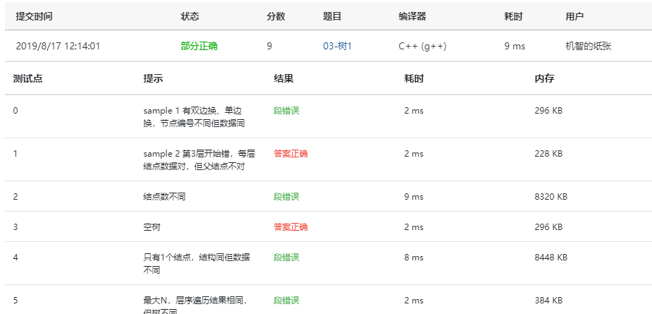
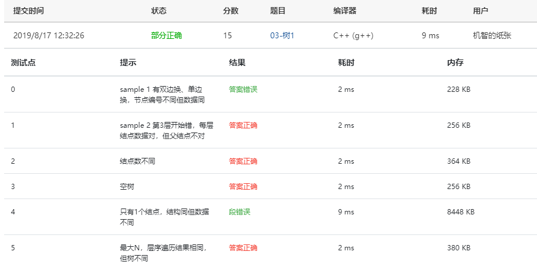
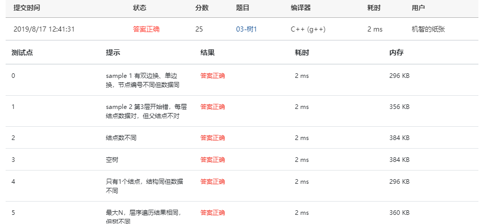

给定两棵树T1和T2。如果T1可以通过若干次左右孩子互换就变成T2，则我们称两棵树是“同构”的。例如图1给出的两棵树就是同构的，因为我们把其中一棵树的结点A、B、G的左右孩子互换后，就得到另外一棵树。而图2就不是同构的。


图1


图2

现给定两棵树，请你判断它们是否是同构的。


### 输入格式:

输入给出2棵二叉树树的信息。对于每棵树，首先在一行中给出一个非负整数*N* (≤10)，即该树的结点数（此时假设结点从0到*N*−1编号）；随后*N*行，第*i*行对应编号第*i*个结点，给出该结点中存储的1个英文大写字母、其左孩子结点的编号、右孩子结点的编号。如果孩子结点为空，则在相应位置上给出“-”。给出的数据间用一个空格分隔。注意：题目保证每个结点中存储的字母是不同的。

### 输出格式:

如果两棵树是同构的，输出“Yes”，否则输出“No”。

### 输入样例1（对应图1）：

```in
8
A 1 2
B 3 4
C 5 -
D - -
E 6 -
G 7 -
F - -
H - -
8
G - 4
B 7 6
F - -
A 5 1
H - -
C 0 -
D - -
E 2 -
```

### 输出样例1:

```out
Yes
```

### 输入样例2（对应图2）：

```
8
B 5 7
F - -
A 0 3
C 6 -
H - -
D - -
G 4 -
E 1 -
8
D 6 -
B 5 -
E - -
H - -
C 0 2
G - 3
F - -
A 1 4
```

### 输出样例2:

```
No
```

### 答案：

#### 第一次：

```c
#include<stdio.h>
#include<stdlib.h>
#define NULL -1
#define MAXSIZE 10

typedef int Tree;
struct TNode {
    char Data;
    Tree Left;
    Tree Right;
};

struct TNode T1[MAXSIZE];
struct TNode T2[MAXSIZE];

Tree BuildTree( TNode T[] )
{
    int N, i;
    Tree Root = NULL;
    char cl, cr;
    scanf("%d", &N);
    int check[N];
    if(N) {
        for( i = 0; i < N; i++ ) check[i] = 0;
        for( i = 0; i < N; i++ ) {
            scanf("%c %c %c", &T[i].Data, &cl, &cr);
            if( cl != '-' ) {
                T[i].Left = cl - '0';
                check[T[i].Left] = 1;
            }
            else T[i].Left = NULL;
            if( cr != '-' ) {
                T[i].Right = cr - '0';
                check[T[i].Right] = 1;
            }
            else T[i].Right = NULL;
        }
        for( i = 0; i < N; i++ ) {
            if(!check[i]) break;
        }
        Root = i;
    }
    return Root;
}

int Isomorphic ( Tree R1, Tree R2 )
{
    if(R1==NULL && R2==NULL) return 1;
    else if(R1!=NULL && R2!=NULL && T1[R1].Data == T2[R2].Data)
        return( Isomorphic(T1[R1].Left, T2[R2].Left) &&
                Isomorphic(T1[R1].Right, T2[R2].Right) ||
                Isomorphic(T1[R1].Left, T2[R2].Right) &&
                Isomorphic(T1[R1].Right, T2[R2].Left));
    else return 0;
}

int main()
{
    Tree R1, R2;
    R1 = BuildTree(T1);
    R2 = BuildTree(T2);
    if(Isomorphic(R1, R2))
        printf("Yes\n");
    else
        printf("No\n");
    return 0;
}
```

#### 提交截图：



这道题老师上课讲过，自己根据老师讲的改编了一下，但是答案不对。。。

#### 第二次：

```c
#include<stdio.h>
#include<stdlib.h>
#define Null -1
#define MAXSIZE 10

typedef int Tree;
struct TNode {
    char Data;
    Tree Left;
    Tree Right;
}T1[MAXSIZE],T2[MAXSIZE];

int check[MAXSIZE];

Tree BuildTree( TNode T[] )
{
    int N, i;
    Tree Root = Null;
    char cl, cr;
    scanf("%d", &N);
    if(N) {
        for( i = 0; i < N; i++ ) check[i] = 0;
        for( i = 0; i < N; i++ ) {
            scanf("%c %c %c", &T[i].Data, &cl, &cr);
            if( cl != '-' ) {
                T[i].Left = cl - '0';
                check[T[i].Left] = 1;
            }
            else T[i].Left = Null;
            if( cr != '-' ) {
                T[i].Right = cr - '0';
                check[T[i].Right] = 1;
            }
            else T[i].Right = Null;
        }
        for( i = 0; i < N; i++ ) {
            if(!check[i]) break;
        }
        Root = i;
    }
    return Root;
}

int Isomorphic ( Tree R1, Tree R2 )
{
    if(R1==Null && R2==Null) return 1;
    else if(R1!=Null && R2!=Null && T1[R1].Data == T2[R2].Data)
        return( Isomorphic(T1[R1].Left, T2[R2].Left) &&
                Isomorphic(T1[R1].Right, T2[R2].Right) ||
                Isomorphic(T1[R1].Left, T2[R2].Right) &&
                Isomorphic(T1[R1].Right, T2[R2].Left));
    else return 0;
}

int main()
{
    Tree R1, R2;
    R1 = BuildTree(T1);
    R2 = BuildTree(T2);
    if(Isomorphic(R1, R2))
        printf("Yes\n");
    else
        printf("No\n");
    return 0;
}
```

#### 提交截图：



发现`check[]`这个数组的定义在`BuildTree( TNode T[])`里了，导致结点数不同的时候会出现问题。

#### 第三次：

```c
#include<stdio.h>
#include<stdlib.h>
#define Null -1
#define MAXSIZE 10

typedef int Tree;
struct TNode {
    char Data;
    Tree Left;
    Tree Right;
}T1[MAXSIZE],T2[MAXSIZE];

int check[MAXSIZE];
int N, i;
char cl, cr;

Tree BuildTree( TNode T[] )
{
    Tree Root = Null;
    scanf("%d", &N);
    if(N) {
        for( i = 0; i < N; i++ ) check[i] = 0;
        for( i = 0; i < N; i++ ) {
            scanf("\n%c %c %c", &T[i].Data, &cl, &cr);
            if( cl != '-' ) {
                T[i].Left = cl - '0';
                check[T[i].Left] = 1;
            }
            else T[i].Left = Null;
            if( cr != '-' ) {
                T[i].Right = cr - '0';
                check[T[i].Right] = 1;
            }
            else T[i].Right = Null;
        }
        for( i = 0; i < N; i++ ) {
            if(!check[i]) break;
        }
        Root = i;
    }
    return Root;
}

int Isomorphic ( Tree R1, Tree R2 )
{
    if(R1==Null && R2==Null) return 1;
    else if(R1!=Null && R2!=Null && T1[R1].Data == T2[R2].Data)
        return( Isomorphic(T1[R1].Left, T2[R2].Left) &&
                Isomorphic(T1[R1].Right, T2[R2].Right) ||
                Isomorphic(T1[R1].Left, T2[R2].Right) &&
                Isomorphic(T1[R1].Right, T2[R2].Left));
    else return 0;
}

int main()
{
    Tree R1, R2;
    R1 = BuildTree(T1);
    R2 = BuildTree(T2);
    if(Isomorphic(R1, R2))
        printf("Yes\n");
    else
        printf("No\n");
    return 0;
}
```

#### 提交截图：



在把读取树的结点的`scanf("%c %c %c")`修改成`scanf("\n%c %c %c")`后完全正确，可能是因为错误的那两个数据中，某一行在换行之前多了空格，导致后面顺序错乱。