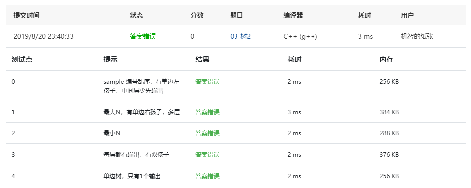

Given a tree, you are supposed to list all the leaves in the order of top down, and left to right.

### Input Specification:

Each input file contains one test case. For each case, the first line gives a positive integer *N* (≤10) which is the total number of nodes in the tree -- and hence the nodes are numbered from 0 to *N*−1. Then *N* lines follow, each corresponds to a node, and gives the indices of the left and right children of the node. If the child does not exist, a "-" will be put at the position. Any pair of children are separated by a space.

### Output Specification:

For each test case, print in one line all the leaves' indices in the order of top down, and left to right. There must be exactly one space between any adjacent numbers, and no extra space at the end of the line.

### Sample Input:

```in
8
1 -
- -
0 -
2 7
- -
- -
5 -
4 6
```

### Sample Output:

```out
4 1 5
```

### Answers:

#### First try:

```c
#include<stdio.h>
#include<stdlib.h>
#define Null -1
#define MAXSIZE 10
#define ERROR -1

typedef int flag;
typedef int Tree;
typedef struct QNode *Queue;

struct QNode {
    Tree Data[MAXSIZE];
    int rear;
    int front;
};

struct TNode {
    int Data;
    Tree left;
    Tree right;
    flag leaf = 0;/*1表示是叶子结点，0不是叶子结点*/
};

struct TNode T1[MAXSIZE];


void AddQ( Queue PtrQ, Tree item )
{
    if((PtrQ->rear+1) % MAXSIZE == PtrQ->front ) {
        printf("队列满");
        return;
    }
    PtrQ->rear = (PtrQ->rear+1) % MAXSIZE;
    PtrQ->Data[PtrQ->rear] = item;
}

Tree DeleteQ( Queue PtrQ )
{
    if( PtrQ->front == PtrQ->rear ) {
        return ERROR;
    } else {
        PtrQ->front = (PtrQ->front-1) % MAXSIZE;
        return PtrQ->Data[PtrQ->front];
    }
}

Queue CreateQueue()
{
    Queue Q;
    Q = (Queue)malloc(sizeof(struct QNode));
    Q->front = 0;
    Q->rear = 0;
    return Q;
}

Tree BuildeTree( TNode T[] )
{
    int N, i;
    Tree Root = Null;
    char cl, cr;
    scanf("%d", &N);
    int check[N];
    if(N) {
        for( i = 0; i < N; i++ ) check[i] = 0;
        for( i = 0; i < N; i++ ) {
            T[i].Data = i;
            scanf("\n%c %c", &cl, &cr);
            if(cl == '-' && cr == '-') {
                T[i].leaf = 1;
                T[i].left = Null;
                T[i].right = Null;
            } else if (cl == '-' && cr != '-') {
                T[i].left = Null;
                T[i].right = cr - '0';
                check[T[i].right] = 1;
            } else if (cl != '-' && cr == '-') {
                T[i].left = cl - '0';
                T[i].right = Null;
                check[T[i].left] = 1;
            } else {
                T[i].left = cl - '0';
                T[i].right = cr - '0';
                check[T[i].left] = 1;
                check[T[i].right] = 1;
            }
        }
        for( i = 0; i < N; i++ ) {
            if(!check[i]) break;
        }
        Root = i;
    }
    return Root;
}

int IsEmptyQ( Queue Q )
{
    if( Q->rear == Q->front ) return 1;
    return 0;
}

void LevelOrderTraversal ( Tree node )
{
    Queue Q;
    Tree T;
    if( node == Null ) return;
    Q = CreateQueue();
    AddQ( Q, node );
    int tag = 0;
    int cnt = MAXSIZE;
    while( !cnt ) {
        T = DeleteQ( Q );
        if(T == ERROR) break;
        if( T1[T].leaf ) {
            if(tag == 0) printf("%d", T);
            else printf(" %d", T);
            tag++;
        }
        if( T1[T].left ) AddQ( Q, T1[T].left );
        if( T1[T].right ) AddQ( Q, T1[T].right );
        cnt--;
    }
}

int main()
{
    Tree R1;
    R1 = BuildeTree(T1);
    LevelOrderTraversal(R1);
    return 0;
}
```

#### ScreenShot:

