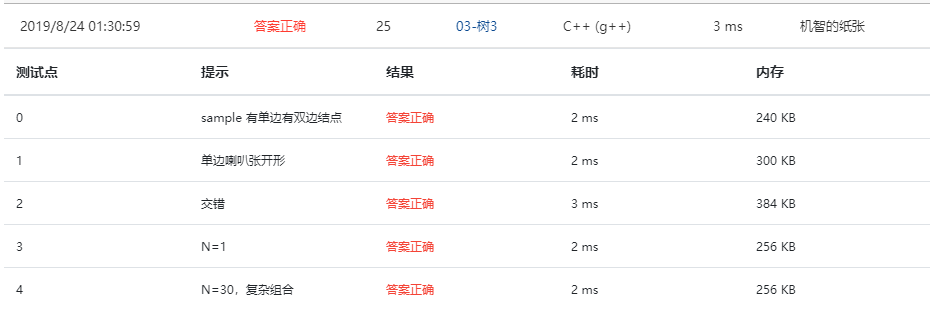

An inorder binary tree traversal can be implemented in a non-recursive way with a stack. For example, suppose that when a 6-node binary tree (with the keys numbered from 1 to 6) is traversed, the stack operations are: push(1); push(2); push(3); pop(); pop(); push(4); pop(); pop(); push(5); push(6); pop(); pop(). Then a unique binary tree (shown in Figure 1) can be generated from this sequence of operations. Your task is to give the postorder traversal sequence of this tree.


Figure 1

### Input Specification:

Each input file contains one test case. For each case, the first line contains a positive integer *N* (≤30) which is the total number of nodes in a tree (and hence the nodes are numbered from 1 to *N*). Then 2*N* lines follow, each describes a stack operation in the format: "Push X" where X is the index of the node being pushed onto the stack; or "Pop" meaning to pop one node from the stack.

### Output Specification:

For each test case, print the postorder traversal sequence of the corresponding tree in one line. A solution is guaranteed to exist. All the numbers must be separated by exactly one space, and there must be no extra space at the end of the line.

### Sample Input:

```in
6
Push 1
Push 2
Push 3
Pop
Pop
Push 4
Pop
Pop
Push 5
Push 6
Pop
Pop
```

### Sample Output:

```out
3 4 2 6 5 1
```

### Answers:

#### First try:

```c
#include<stdio.h>
#include<stdlib.h>
#include<string.h>
#define MaxSize 30
#define Null -1


typedef struct SNode *Stack;
typedef struct TNode *Tree;
struct SNode {
    int Data[MaxSize];
    int Top;
};

struct TNode {
    int Data;
    Tree Left;
    Tree Right;
};

void Push( Stack PtrS, int item )
{
    if ( PtrS->Top == MaxSize - 1 ) return;
    else {
        PtrS->Data[++(PtrS->Top)] = item;
        return;
    }
}

int Pop( Stack PtrS )
{
    if ( PtrS->Top == -1 ) return Null;
    else {
        return PtrS->Data[(PtrS->Top)--];
    }
}

Tree NewNode( int V )
{
    Tree T;
    T = (Tree)malloc(sizeof(struct TNode));                 
    T->Data = V;
    T->Left = T->Right = NULL;
    return T;
}

void PostOrderTraversal( TNode T[], int Root, int N )
{
    int cnt = 0;
    Tree BT = T + Root, PrePop = NULL;
    Stack S;
    S = (Stack)malloc(sizeof(struct SNode));
    S->Top = 0;
    while( BT || S->Top != 0 ) {
        while( BT ) {
            Push( S, BT->Data );
            BT = BT->Left;
        }
        while( S->Top != 0 ) {
            BT = T + Pop(S);
            if( BT->Right == PrePop || BT->Right ==NULL ) {
                if( cnt == 0 ) printf("%d", BT->Data);
                else printf(" %d", BT->Data);
                cnt++;
            } else {
                Push(S, BT->Data);
                BT = BT->Right;
                break;
            }
        }
    }
}

int main()
{
    int N, cnt, v, i, Root;
    char Method[4];
    Stack S;
    S = (Stack)malloc(sizeof(struct SNode));
    S->Top = 0;
    scanf("%d", &N);
    cnt = 2*N;
    struct TNode T[N];
    for (i = 0; i < N; i++) {
        T[i].Data = i;
        T[i].Left = NULL;
        T[i].Right = NULL;
    }
    while( cnt ) {
        scanf("%s", Method);
        if( strcmp(Method,"Push") == 0 ) {
            scanf("%d", &v);
            Push(S, v);
            if(cnt == 2*N) Root = v;
        }
        if( strcmp(Method,"Pop") == 0 ) {
            v = Pop(S);
            if( T[S->Data[S->Top]].Left ) {
                T[S->Data[S->Top]].Right = (T + v);
            } else {
                T[S->Data[S->Top]].Left = (T + v);
            }
        }
        cnt -= 1;
    }
    PostOrderTraversal(T, Root, N);
    return 0;
}
```

#### ScreenShot:


又是不知道哪里出现了错误。。

#### Second try:

```c
#include<stdio.h>
#include<stdlib.h>
#include<string.h>
#define MaxSize 30
#define Null -1


typedef struct SNode *Stack;
typedef struct TNode *Tree;
struct SNode {
    int Data[MaxSize];
    int Top;
};

struct TNode {
    int Data;
    Tree Left;
    Tree Right;
};

void Push( Stack PtrS, int item )
{
    if ( PtrS->Top == MaxSize - 1 ) return;
    else {
        PtrS->Data[++(PtrS->Top)] = item;
        return;
    }
}

int Pop( Stack PtrS )
{
    if ( PtrS->Top == -1 ) return Null;
    else {
        return PtrS->Data[(PtrS->Top)--];
    }
}

Tree NewNode( int V )
{
    Tree T;
    T = (Tree)malloc(sizeof(struct TNode));                 
    T->Data = V;
    T->Left = T->Right = NULL;
    return T;
}

void PostOrderTraversal( TNode T[], int Root, int N )
{
    int cnt = 0;
    Tree BT = T + Root, PrePop = NULL;
    Stack S;
    S = (Stack)malloc(sizeof(struct SNode));
    S->Top = 0;
    while( BT || S->Top != 0 ) {
        while( BT ) {
            Push( S, BT->Data );
            BT = BT->Left;
        }
        while( S->Top != 0 ) {
            BT = T + Pop(S);
            if( BT->Right == PrePop || BT->Right ==NULL ) {
                if( cnt == 0 ) printf("%d", BT->Data);
                else printf(" %d", BT->Data);
                cnt++;
            } else {
                Push(S, BT->Data);
                BT = BT->Right;
                break;
            }
        }
        if(cnt==N) break;
    }
    return;
}

int main()
{
    int N, cnt, v, i, Root, PrePop = -1, PrePush = -1;
    int PopFlag = 0, PushFlag = 0;
    char Method[4];
    Stack S;
    S = (Stack)malloc(sizeof(struct SNode));
    S->Top = 0;
    scanf("%d", &N);
    cnt = 2*N;
    struct TNode T[N];
    for (i = 0; i < N; i++) {
        T[i].Data = i;
        T[i].Left = NULL;
        T[i].Right = NULL;
    }
    while( cnt ) {
        scanf("%s", Method);
        if( strcmp(Method,"Push") == 0 ) {
            scanf("%d", &v);
            if(PrePush != -1 && PushFlag) {
                T[PrePush].Left = (T + v);
            }
            Push(S, v);
            PrePush = v;
            if(cnt == 2*N) Root = v;
            if(PrePop != -1 && PopFlag) {
                if( T[PrePop].Left ) {
                    T[PrePop].Right = (T + v);
                } else {
                    T[PrePop].Left = (T + v);
                }
            }
            PushFlag = 1;
            PopFlag = 0;
        }
        if( strcmp(Method,"Pop") == 0 ) {
            PrePop = Pop(S);
            PopFlag = 1;
            PushFlag = 0;
        }
        cnt -= 1;
    }
    PostOrderTraversal(T, Root, N);
    return 0;
}
```

#### ScreenShots:


.png)

测试之后发现自己的根据先序遍历来建立树的程序写错了，修改之后至少树可以正确建立，但后序遍历的程序有问题如下：

.png) 

问题应该是堆栈压入4这个结点后出现了错误，不停的重复自己。

#### Third try:

```c
#include<stdio.h>
#include<stdlib.h>
#include<string.h>
#define MaxSize 31
#define Null -1

int Root;
typedef struct SNode *Stack;
typedef struct TNode *Tree;
struct SNode {
    int Data[MaxSize];
    int Top;
};

struct TNode {
    int Data;
    Tree Left;
    Tree Right;
};

void Push( Stack PtrS, int item )
{
    if ( PtrS->Top == MaxSize - 1 ) return;
    else {
        PtrS->Data[++(PtrS->Top)] = item;
        return;
    }
}

int Pop( Stack PtrS )
{
    if ( PtrS->Top == -1 ) return Null;
    else {
        return PtrS->Data[(PtrS->Top)--];
    }
}

Tree NewNode( int V )
{
    Tree T;
    T = (Tree)malloc(sizeof(struct TNode));                 
    T->Data = V;
    T->Left = T->Right = NULL;
    return T;
}

void PostOrderTraversal(TNode T[], int index)
{
	if( T[index].Left != NULL ) {
	    PostOrderTraversal( T, T[index].Left->Data );
	}
	if( T[index].Right != NULL ) {
	    PostOrderTraversal( T, T[index].Right->Data );
	}
	if( index == Root ) {
	    printf("%d", T[Root].Data);
	} else {
	    printf("%d ", T[index].Data);
	}
	return;
}

int main()
{
    int N, cnt, v, i, PrePop = -1, PrePush = -1;
    int PopFlag = 0, PushFlag = 0;
    char Method[4];
    Stack S;
    S = (Stack)malloc(sizeof(struct SNode));
    S->Top = -1;
    scanf("%d", &N);
    cnt = 2*N;
    struct TNode T[MaxSize];
    for (i = 0; i < MaxSize; i++) {
        T[i].Data = i;
        T[i].Left = NULL;
        T[i].Right = NULL;
    }
    while( cnt ) {
        scanf("%s", Method);
        if( strcmp(Method,"Push") == 0 ) {
            scanf("%d", &v);
            if(PrePush != -1 && PushFlag) {
                T[PrePush].Left = (T + v);
            }
            Push(S, v);
            PrePush = v;
            if(cnt == 2*N) Root = v;
            if(PrePop != -1 && PopFlag) {
                if( T[PrePop].Left ) {
                    T[PrePop].Right = (T + v);
                } else {
                    T[PrePop].Left = (T + v);
                }
            }
            PushFlag = 1;
            PopFlag = 0;
        }
        if( strcmp(Method,"Pop") == 0 ) {
            PrePop = Pop(S);
            PopFlag = 1;
            PushFlag = 0;
        }
        cnt -= 1;
    }
    //printf("%d",Root);
    PostOrderTraversal(T, Root);
    return 0;
}
```

又调试了一个多小时，问题出在！树的初始化！！！以后一定记得用最大值来初始化数组，并且这里想当然的位置想错了，导致数组下标和数值一样，但是输入的数字是从1开始的！！！！！一定记得！！！！这次把`MaxSize`加了`1`，但以后尽量不使用这种方法，还有以后树的遍历问题最好使用递归函数，非递归函数搞死人了

#### ScreenShot:

