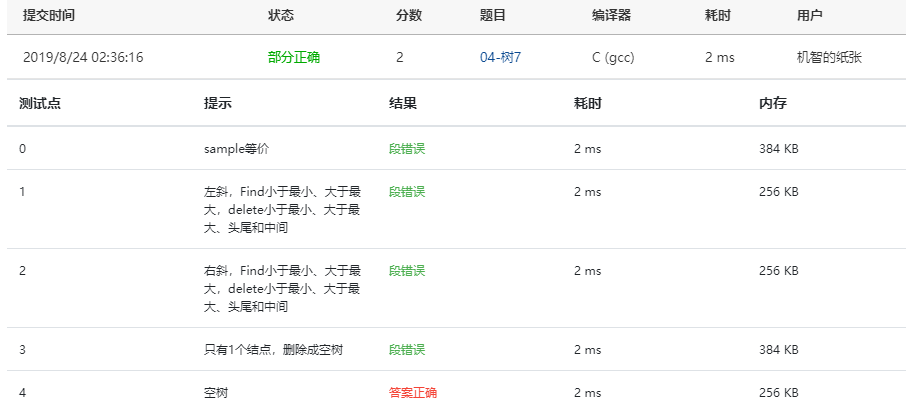

本题要求实现给定二叉搜索树的5种常用操作。

### 函数接口定义：

```c++
BinTree Insert( BinTree BST, ElementType X );
BinTree Delete( BinTree BST, ElementType X );
Position Find( BinTree BST, ElementType X );
Position FindMin( BinTree BST );
Position FindMax( BinTree BST );
```

其中`BinTree`结构定义如下：

```c++
typedef struct TNode *Position;
typedef Position BinTree;
struct TNode{
    ElementType Data;
    BinTree Left;
    BinTree Right;
};
```

- 函数`Insert`将`X`插入二叉搜索树`BST`并返回结果树的根结点指针；
- 函数`Delete`将`X`从二叉搜索树`BST`中删除，并返回结果树的根结点指针；如果`X`不在树中，则打印一行`Not Found`并返回原树的根结点指针；
- 函数`Find`在二叉搜索树`BST`中找到`X`，返回该结点的指针；如果找不到则返回空指针；
- 函数`FindMin`返回二叉搜索树`BST`中最小元结点的指针；
- 函数`FindMax`返回二叉搜索树`BST`中最大元结点的指针。

### 裁判测试程序样例：

```c++
#include <stdio.h>
#include <stdlib.h>

typedef int ElementType;
typedef struct TNode *Position;
typedef Position BinTree;
struct TNode{
    ElementType Data;
    BinTree Left;
    BinTree Right;
};

void PreorderTraversal( BinTree BT ); /* 先序遍历，由裁判实现，细节不表 */
void InorderTraversal( BinTree BT );  /* 中序遍历，由裁判实现，细节不表 */

BinTree Insert( BinTree BST, ElementType X );
BinTree Delete( BinTree BST, ElementType X );
Position Find( BinTree BST, ElementType X );
Position FindMin( BinTree BST );
Position FindMax( BinTree BST );

int main()
{
    BinTree BST, MinP, MaxP, Tmp;
    ElementType X;
    int N, i;

    BST = NULL;
    scanf("%d", &N);
    for ( i=0; i<N; i++ ) {
        scanf("%d", &X);
        BST = Insert(BST, X);
    }
    printf("Preorder:"); PreorderTraversal(BST); printf("\n");
    MinP = FindMin(BST);
    MaxP = FindMax(BST);
    scanf("%d", &N);
    for( i=0; i<N; i++ ) {
        scanf("%d", &X);
        Tmp = Find(BST, X);
        if (Tmp == NULL) printf("%d is not found\n", X);
        else {
            printf("%d is found\n", Tmp->Data);
            if (Tmp==MinP) printf("%d is the smallest key\n", Tmp->Data);
            if (Tmp==MaxP) printf("%d is the largest key\n", Tmp->Data);
        }
    }
    scanf("%d", &N);
    for( i=0; i<N; i++ ) {
        scanf("%d", &X);
        BST = Delete(BST, X);
    }
    printf("Inorder:"); InorderTraversal(BST); printf("\n");

    return 0;
}
/* 你的代码将被嵌在这里 */
```

### 输入样例：

```in
10
5 8 6 2 4 1 0 10 9 7
5
6 3 10 0 5
5
5 7 0 10 3
```

### 输出样例：

```out
Preorder: 5 2 1 0 4 8 6 7 10 9
6 is found
3 is not found
10 is found
10 is the largest key
0 is found
0 is the smallest key
5 is found
Not Found
Inorder: 1 2 4 6 8 9
```

### 答案：

#### 第一次：

```c
BinTree Insert( BinTree BST, ElementType X )
{
    if( !BST ) {
        BST = (BinTree)malloc(sizeof(struct TNode));
        BST->Data = X;
        BST->Left = NULL;
        BST->Right = NULL;
    } else {
        if( X < BST->Data ) {
            BST->Left = Insert( BST->Left, X );
        } else if ( X > BST->Data ) {
            BST->Right = Insert( BST->Right, X );
        }
    }
    return BST;
}

BinTree Delete( BinTree BST, ElementType X )
{
    Position tmp;
    if( !Find(BST, X) ) {
        printf("Not Found\n");
        return BST;
    } else if( X < BST->Data ) {
        BST->Left = Delete( BST->Left, X );
    } else if( X > BST->Data ) {
        BST->Right = Delete( BST->Right, X );
    } else if( BST->Left && BST->Right ) {
        tmp = FindMin( BST->Right );
        BST->Data = tmp->Data;
        BST->Right = Delete( BST->Right, BST->Data );
    } else {
        tmp = BST;
        if( !tmp->Left )
            BST = BST->Right;
        if( !tmp->Right )
            BST = BST->Left;
        free(tmp);
    }
    return BST;
}

Position Find( BinTree BST, ElementType X )
{
    BinTree tmp;
    tmp = BST;
    while( X != tmp->Data ) {
        if( X < tmp->Data ) {
            if( X > tmp->Left->Data ) {
                return NULL;
            } else {
                tmp = tmp->Left;
            }
        }
        if( X > tmp->Data ) {
            if( X < tmp->Right->Data ) {
                return NULL;
            } else {
                tmp = tmp->Right;
            }
        }
    }
    return tmp;
}

Position FindMin( BinTree BST )
{
    if( BST ) {
        while( BST->Left ) {
            BST = BST->Left;
        }
    }   
    return BST;
}

Position FindMax( BinTree BST )
{
    if( BST ) {
        while( BST->Right ) {
            BST = BST->Right;
        }
    }
    return BST;
}
```

#### 提交截图：


自己根据记忆写的，出现了段错误的问题

#### 第二次：

```c
BinTree Insert( BinTree BST, ElementType X )
{
    if( !BST ) {
        BST = (BinTree)malloc(sizeof(struct TNode));
        BST->Data = X;
        BST->Left = NULL;
        BST->Right = NULL;
    } else {
        if( X < BST->Data ) {
            BST->Left = Insert( BST->Left, X );
        } else if ( X > BST->Data ) {
            BST->Right = Insert( BST->Right, X );
        }
    }
    return BST;
}

BinTree Delete( BinTree BST, ElementType X )
{
    Position tmp;
    if( !Find(BST, X) && !BST ) {
        printf("Not Found\n");
    } else if( X < BST->Data ) {
        BST->Left = Delete( BST->Left, X );
    } else if( X > BST->Data ) {
        BST->Right = Delete( BST->Right, X );
    } else {
        if( BST->Left && BST->Right ) {
            tmp = FindMin( BST->Right );
            BST->Data = tmp->Data;
            BST->Right = Delete( BST->Right, BST->Data );
        } else {
            tmp = BST;
            if( !tmp->Left )
                BST = BST->Right;
            if( !tmp->Right )
                BST = BST->Left;
        free(tmp);
        }
    }
    return BST;
}

Position Find( BinTree BST, ElementType X )
{
    while( BST ) {
        if ( X > BST->Data )
            BST = BST->Right;
        else if ( X < BST->Data )
            BST = BST->Left;
        else
            return BST;
    }
    return NULL;
}

Position FindMin( BinTree BST )
{
    if( BST ) {
        while( BST->Left ) {
            BST = BST->Left;
        }
    }   
    return BST;
}

Position FindMax( BinTree BST )
{
    if( BST ) {
        while( BST->Right ) {
            BST = BST->Right;
        }
    }
    return BST;
}
```

#### 提交截图：



将`Find`函数修改为课上的笔记，结果仍然不对，目前除了`FindMin`和`FindMax`其他都和笔记一样，说明这两个函数还是有问题，`Find`的修改如下：

```c
Position Find( BinTree BST, ElementType X )
{
    BinTree tmp;
    tmp = BST;
    while( X != tmp->Data ) {
        if( X < tmp->Data ) {
            if( X > tmp->Left->Data ) {
                return NULL;
            } else {
                tmp = tmp->Left;
            }
        }
        if( X > tmp->Data ) {
            if( X < tmp->Right->Data ) {
                return NULL;
            } else {
                tmp = tmp->Right;
            }
        }
    }
    return tmp;
}

Position Find( BinTree BST, ElementType X )
{
    while( BST ) {
        if ( X > BST->Data )
            BST = BST->Right;
        else if ( X < BST->Data )
            BST = BST->Left;
        else
            return BST;
    }
    return NULL;
}
```

发现自己在乱写循环，可能是因为太晚了头脑不清楚，但也说明了基本功太差

#### 第三次：

```c
BinTree Insert( BinTree BST, ElementType X )
{
    if( !BST ) {
        BST = (BinTree)malloc(sizeof(struct TNode));
        BST->Data = X;
        BST->Left = NULL;
        BST->Right = NULL;
    } else {
        if( X < BST->Data ) {
            BST->Left = Insert( BST->Left, X );
        } else if ( X > BST->Data ) {
            BST->Right = Insert( BST->Right, X );
        }
    }
    return BST;
}

BinTree Delete( BinTree BST, ElementType X )
{
    Position tmp;
    if( !Find(BST, X) || !BST ) {
        printf("Not Found\n");
    } else if( X < BST->Data ) {
        BST->Left = Delete( BST->Left, X );
    } else if( X > BST->Data ) {
        BST->Right = Delete( BST->Right, X );
    } else {
        if( BST->Left && BST->Right ) {
            tmp = FindMin( BST->Right );
            BST->Data = tmp->Data;
            BST->Right = Delete( BST->Right, BST->Data );
        } else {
            tmp = BST;
            if( !tmp->Left )
                BST = BST->Right;
            else if( !tmp->Right )
                BST = BST->Left;
            free(tmp);
        }
    }
    return BST;
}

Position Find( BinTree BST, ElementType X )
{
    while( BST ) {
        if ( X > BST->Data )
            BST = BST->Right;
        else if ( X < BST->Data )
            BST = BST->Left;
        else
            return BST;
    }
    return NULL;
}

Position FindMin( BinTree BST )
{
    if( !BST ) return NULL;
    else if ( !BST->Left) {
        return BST;
    } else {
        return FindMin( BST->Left );
    }
}

Position FindMax( BinTree BST )
{
    if( BST ) {
        while( BST->Right ) {
            BST = BST->Right;
        }
    }
    return BST;
}
```

#### 提交截图：


找了半天错误，最终发现是一个很细节的地方：

```c
BinTree Delete( BinTree BST, ElementType X )
{
    Position tmp;
    if( !Find(BST, X) && !BST ) {
        printf("Not Found\n");
    } else if( X < BST->Data ) {
        BST->Left = Delete( BST->Left, X );
    } else if( X > BST->Data ) {
        BST->Right = Delete( BST->Right, X );
    } else {
        if( BST->Left && BST->Right ) {
            tmp = FindMin( BST->Right );
            BST->Data = tmp->Data;
            BST->Right = Delete( BST->Right, BST->Data );
        } else {
            tmp = BST;
            if( !tmp->Left )
                BST = BST->Right;
            if( !tmp->Right )		/* 就是这里出现了错误，其实加一个else就解决了 */
                BST = BST->Left;
        free(tmp);
        }
    }
    return BST;
}
```

又是一个细节方面的错误！已经三点了，是时候睡觉了。。